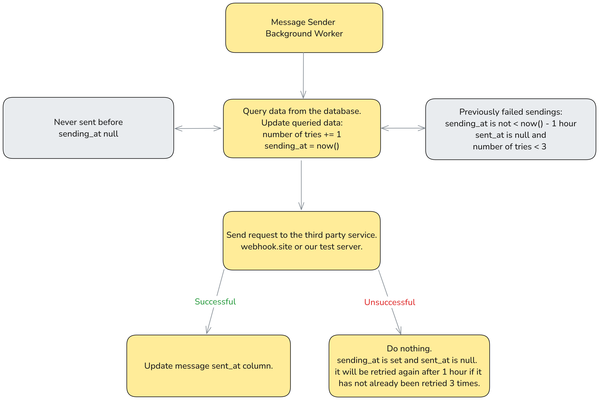

# Insider Assesment Project

This project implements an automatic message sending system based on the given requirements.

## Getting Started

### Prerequisites

- Docker
- Git

### Installation

1. Clone the repository:
   ```bash
   git clone git@github.com:emincanozcan/insider-assessment.git
   cd insider-assessment
   ```

2. Start the services using docker compose:
    ```bash
    docker compose up
    ```
   This will start all the necessary services, including a custom webhook.site imitation server.

3. Go to [localhost:8080/swagger](http://localhost:8080/swagger) to get started.

### Configuration

Configuration parameters can be updated within the environment section of the `docker-compose.yml` file.

- `MESSAGE_SEND_INTERVAL`   Message sending interval in seconds (e.g., 120 to send messages every 2 minutes).
- `MESSAGE_SEND_BATCH_SIZE` Number of messages in each sending batch (e.g., 2 to send 2 messages in every interval).
- `WEBHOOK_URL`             URL to send the messages. By default, this is set to the webhook imitation server. It can also be set to an external URL like `https://webhook.site/bla-bla`.
- `WEBHOOK_AUTH_KEY`        Value of the `x-ins-auth-key` header.

### Endpoints

The project includes the following endpoints:

1. `GET /swagger/index.html#`

   Opens the Swagger UI. It's suggested to use this endpoint in a browser. The endpoints below [2-5] can be tried out through this interface.

2. `GET /messages/sent`

   Returns a list of all sent messages.

3. `POST /messages`

   Adds a new message to the system. Body parameters are recipient and content with max character limit validations.

4. `POST /messages/processing/start`

   Starts the background service that sends unsent messages every 2 minutes.

5. `POST /messages/processing/stop`

   Stops the background message sending service.


## Technologies Used

1. Programming Language: Go

2. Database: PostgreSQL

3. Cache: Redis

4. Database query generator: [sqlc](https://github.com/sqlc-dev/sqlc), specifically [sqlc-gen-go](https://github.com/sqlc-dev/sqlc-gen-go)

5. Database migrataion manager: [golang-migrate](https://github.com/golang-migrate/migrate)

6. API Documentation: Swagger - [swaggo/swag](https://github.com/swaggo/swag)

## Message Sending Diagram

Message sending logic might look a bit complex, so this is the diagram(ish) drawing that explains how it works:




## Troubleshooting

### Real Webhook.site Test

This is the endpoint I have used to ensure that the system also works with a real webhook.site address:

[https://webhook.site/d8465148-a1b4-4e27-812e-68a76d2500d0](https://webhook.site/d8465148-a1b4-4e27-812e-68a76d2500d0)

Defined custom actions as below:

1) To validate authorization header `x-ins-auth-key`, add a new `Condition` with the following settings:
   - Input: `$request.header.x-ins-auth-key$`
   - is equal to
   - Value: insider-auth-key-123
   - Then do following: Use result in other actions

2) To return a successful response when the request has correct `x-ins-auth-key` header, add a new `Modify Response` with the following settings:
   - Response Body:
   ```json
   {
      "message": "Accepted",
      "messageId": "$request.uuid$"
   }
   ```
   - Send response and stop action execution: Checked
   - Only run when condition passes: Action #1 (the one we created in the first step)


3) To return an unauthorized response when the request has not correct `x-ins-auth-key` header, add a new `Modify Response` with the following settings:
   - Response Body:
   ```json
   {
      "message": "Unauthorized"
   }
   ```
   - Status Code: 403
   - Only run when condition passes: Always

### Port Issues

By default, the docker compose file exposes:

- port 8080 for the assessment project
- port 8081 for the webhook.site imitation server
- port 5432 for postgresql
- port 6379 for redis

If you encounter any issues due to unavailable ports, feel free to customize these ports.

Service-to-service communication is done via Docker networking, so the ports are opened to the outside only for testing purposes.
